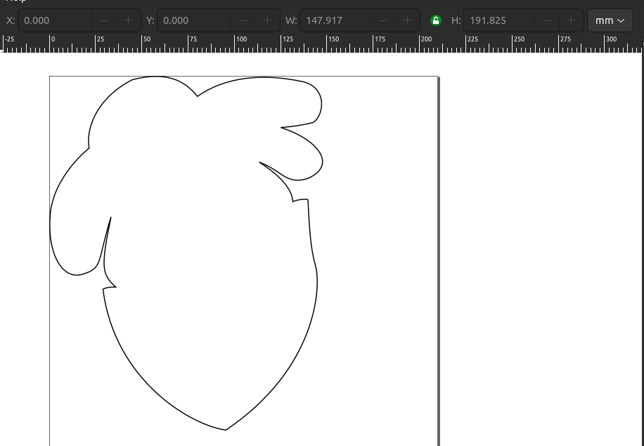
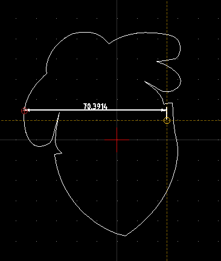
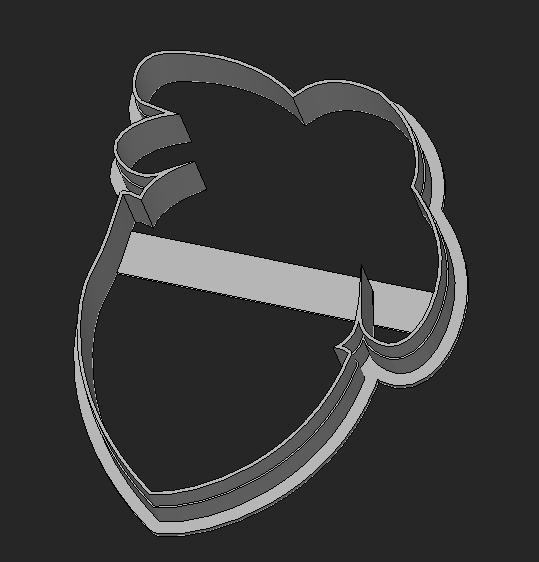
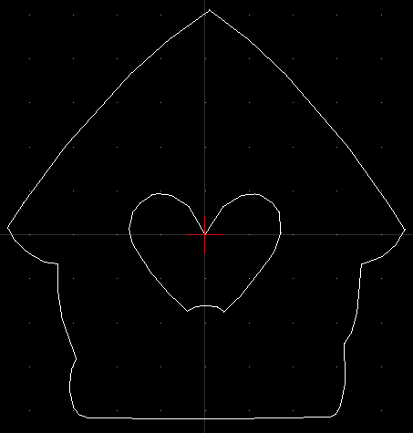
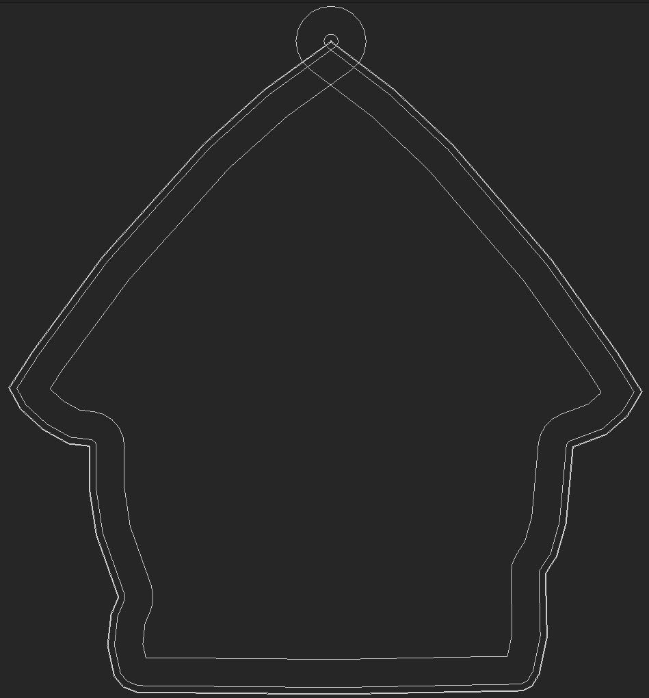
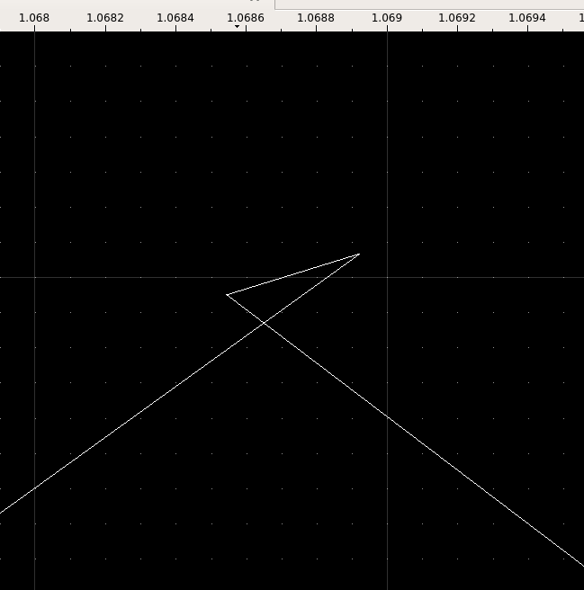
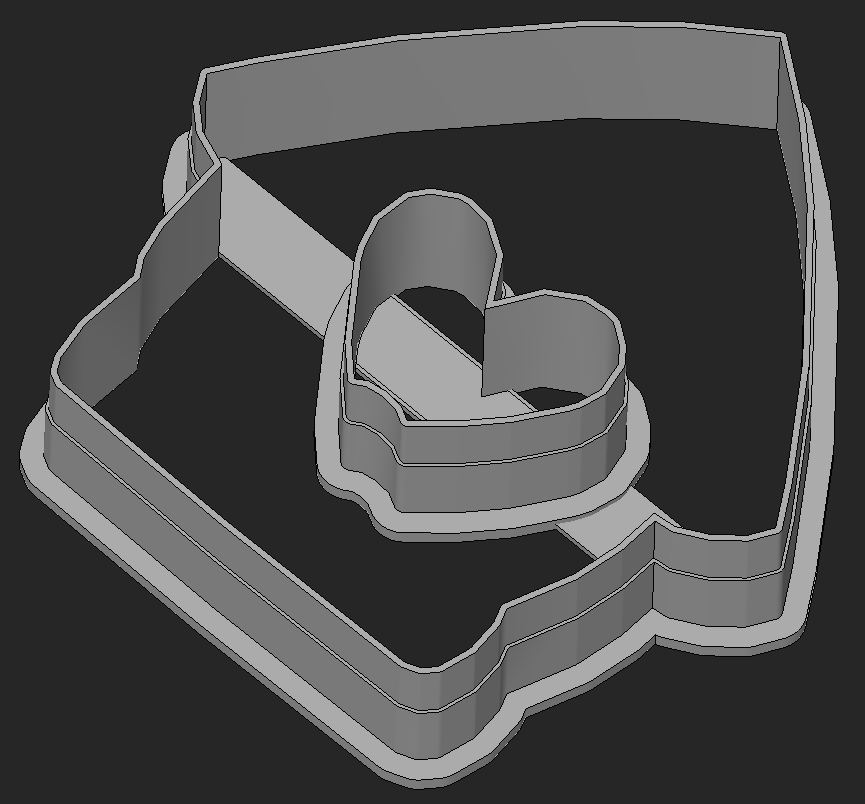

# Cookie Qutter

Create 3-D printable cookie-cutters from a vector drawing with CadQuery.

A small project exercising the broad capabilities of OpenCASCADE and CadQuery.

```sh
$ cookiequtter /path/to/2d.dxf
DEBUG:cookie_qutter.from_dxf:Processing <cadquery.occ_impl.shapes.Wire object at 0x7a104a1f3a00>
# Results in /path/to/2d.stl
```

## Use

Create a 2D rendition of the cookie you'd like to cut out.

I do this using a combination of [Inkscape](https://inkscape.org/) (for drawing)
and [QCAD](https://www.qcad.org/en/) (for scaling), but any software which can
produce DXF files will suffice.

### Installation

This depends on Python and [CadQuery](https://github.com/CadQuery/cadquery).
[Install python](https://www.python.org/downloads/) if you haven't.

Next, install this program. CadQuery and other dependencies will be installed
automatically.

```shell-session
$ python -m venv ./env
$ source ./env/bin/activate
(env) $ python -m pip install cookie_qutter @ git+https://github.com/brhubbar/CookieQutter.git@main
```

### Inkscape + QCAD

Draw the thing you'd like to cut out using Inkscape. Inkscape makes pasting
images to trace easy. You can even draw holes to cut out of the middle of the
cookie. Right now, these are weakly handled by adding a horizontal bar across
the middle of the cookie cutter to hold those extra pieces in place. This
probably needs to be made more flexible for some designs, but I haven't run into
that.



Next, export the SVG from Inkscape as a DXF R12 (the particular format matters,
though I haven't figured out why).

Import the DXF into QCAD. Center and scale the drawing as you see fit. You'll
notice that the dimensions when imported into QCAD do not match those from
Inkscape. Inkscape has a variety of issues open reporting but not fixing this.



Note that small drawings exported from Inkscape will have fewer segments and
result in choppy outlines in QCAD. To avoid this, just scale up the vector
drawing before exporting.


Finally, run CookieQutter to convert the DXF into an STL.

```shell-session
$ cookiequtter /path/to/my.dxf
```

The result will be found at `/path/to/my.stl`



### Troubleshooting

Sometimes, vector drawings will have imperceptible loops in them when converted
to DXF format. These nefarious little suckers can ruin your day if you can't
find them. To help, CookieQutter will export a couple attempts to explode the
loop into view. This will be exported as `/path/to/debug.brep`. This can be
viewed using OpenCASCADE's
[CadAssistant](https://www.opencascade.com/products/cad-assistant/) viewer. An
STL without the broken wire will be exported if at all possible.

This is an example of what a 'bad' DXF looks like at a high level (notice that
it looks fine).



When running, you'll see some messaging like this:

```shell-session
$ cookiequtter /path/to/loopy.dxf
ERROR:cookie_qutter.from_dxf:A wire failed to cutterify. Check for loops or disjointed nodes in QCAD (zoom way in).
Traceback (most recent call last):
  File "/home/brhubbard/Documents/06-Code/CookieQutter/cookie_qutter/from_dxf.py", line 56, in main
    cutter_part = cutterify(wire)
  File "/home/brhubbard/Documents/06-Code/CookieQutter/cookie_qutter/from_dxf.py", line 76, in cutterify
    .offset2D(offsets["handle"], "arc")
  File "/home/brhubbard/Documents/06-Code/CookieQutter/env/lib/python3.10/site-packages/cadquery/cq.py", line 4299, in offset2D
    rv = list(chain.from_iterable(w.offset2D(d, kind) for w in ws))
  File "/home/brhubbard/Documents/06-Code/CookieQutter/env/lib/python3.10/site-packages/cadquery/cq.py", line 4299, in <genexpr>
    rv = list(chain.from_iterable(w.offset2D(d, kind) for w in ws))
  File "/home/brhubbard/Documents/06-Code/CookieQutter/env/lib/python3.10/site-packages/cadquery/occ_impl/shapes.py", line 2334, in offset2D
    obj = downcast(offset.Shape())
  File "/home/brhubbard/Documents/06-Code/CookieQutter/env/lib/python3.10/site-packages/cadquery/occ_impl/shapes.py", line 347, in downcast
    f_downcast: Any = downcast_LUT[shapetype(obj)]
  File "/home/brhubbard/Documents/06-Code/CookieQutter/env/lib/python3.10/site-packages/cadquery/occ_impl/shapes.py", line 337, in shapetype
    raise ValueError("Null TopoDS_Shape object")
ValueError: Null TopoDS_Shape object
INFO:cookie_qutter.from_dxf:Creating /home/brhubbard/Documents/05-3D-Print/Cookie-Cutters/debug.brep for debugging
INFO:cookie_qutter.from_dxf:Continuing without a wire.
```

And the debug file should look something like this:



Zooming (way!) in within QCAD will reveal the issue:



Manually removing that loop will allow the STL creation to run successfully:


